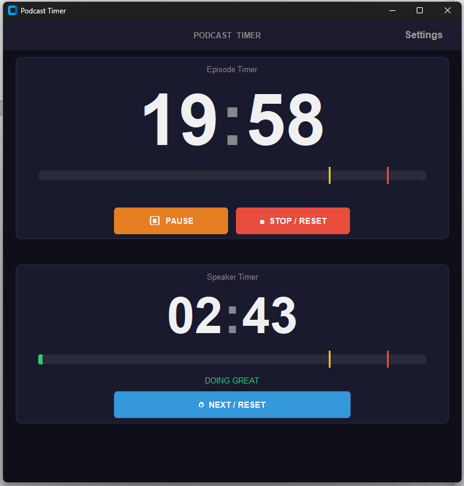

# Podcast Timer

A professional dual-timer application designed for podcast recording, featuring visual cues and audio alerts to help hosts manage episode and speaker timing.



## Features

- **Dual Timers**: Separate timers for episode duration and individual speaker segments
- **Visual Feedback**: 
  - Color-coded backgrounds (yellow at 75%, red at 90%)
  - Contextual status messages
  - Pulsing effects when time expires
- **Audio Cues**: Optional sound alerts at timing thresholds
- **Customizable Settings**:
  - Light/Dark/System themes
  - Adjustable zoom (85%-200%)
  - Always-on-top option
- **Inline Editing**: Quick timer adjustments via intuitive interface
- **Pause/Resume**: Full playback control during recording

## Installation

### Windows
1. Download `PodcastTimer.exe` from the [latest release](../../releases)
2. Run the executable - no installation required!

### macOS / Linux
1. Ensure Python 3.8+ is installed
2. Clone this repository:
   ```bash
   git clone https://github.com/YOUR_USERNAME/podcast-timer.git
   cd podcast-timer
   ```
3. Install dependencies:
   ```bash
   pip install -r requirements.txt
   ```
4. Run the application:
   ```bash
   python podcast_timer.py
   ```

## Building from Source

### Windows
```bash
build_exe.bat
```
The executable will be in the `dist` folder.

### macOS / Linux
```bash
pip install pyinstaller
pyinstaller --onefile --windowed --name "PodcastTimer" podcast_timer.py
```

## Usage

1. **Set Timers**: Click the pencil icon to edit episode and speaker durations
2. **Start Recording**: Hit the START button to begin both timers
3. **Monitor Progress**: Watch for color changes and status messages
4. **Manage Speakers**: Use NEXT/RESET to cycle through speakers
5. **Pause/Resume**: Control timing during breaks

### Timer Stages

**Episode Timer:**
- 🟢 0-50%: Normal recording
- 🟢 50-55%: "HALF WAY THERE"
- 🟡 75-90%: "START SUMMARIZING"
- 🔴 90-100%: "FINALIZE THE EPISODE"
- 🔴 100%+: "TIME'S UP" with pulsing alert

**Speaker Timer:**
- 🟢 0-75%: "DOING GREAT"
- 🟡 75-90%: "GET TO THE POINT"
- 🔴 90-100%: "WRAP IT UP"
- 🔴 100%+: "TIME'S UP" with pulsing alert

## Requirements

- Python 3.8+
- customtkinter >= 5.2.0
- pygame-ce >= 2.4.0
- numpy >= 1.24.0
- darkdetect >= 0.8.0

## Development

This is a single-file Python application built with CustomTkinter for modern UI aesthetics.

### Project Structure
```
podcast-timer/
├── podcast_timer.py      # Main application (single file)
├── requirements.txt      # Python dependencies
├── build_exe.bat        # Windows build script
├── install_and_run.bat  # Windows quick-start script
├── create_icon.py       # Icon generation script
├── podcast_icon.ico     # Application icon
└── README.md           # This file
```

## License

MIT License - see LICENSE file for details

## Credits

Developed by Damon Downing, 2026

---

**Made for podcasters, by podcasters.** 🎙️
