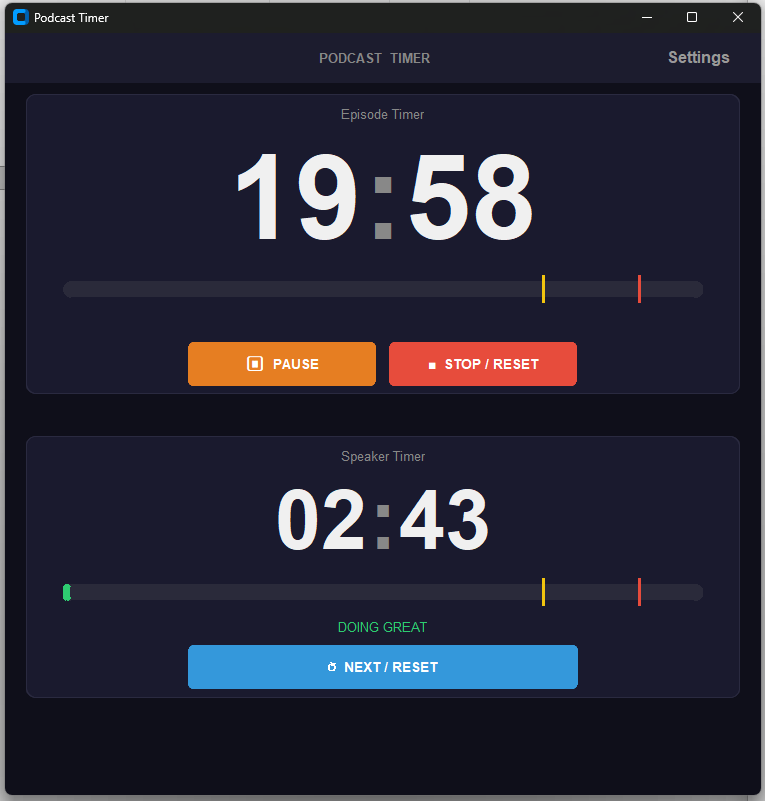

# Podcast Timer

A professional dual-timer application designed for podcast recording, featuring visual cues and audio alerts to help hosts manage episode and speaker timing.



## Features

- **Dual Timers**: Separate timers for episode duration and individual speaker segments
- **Visual Feedback**:
  - Color-coded backgrounds (yellow at 75%, red at 90%)
  - Contextual status messages at key thresholds
  - Pulsing effects when time expires
- **Audio Cues**: Optional sound alerts at timing thresholds
- **Speaker Pause**: Pause the speaker timer independently while the episode timer keeps running
- **Resize-to-Zoom**: Drag the window larger or smaller — the UI scales proportionally
- **Auto-Update Check**: Checks GitHub releases on startup and shows a non-blocking banner if a newer version is available
- **Customizable Settings**:
  - Light/Dark/System themes
  - Always-on-top option
  - Audio cue toggle
- **Inline Editing**: Quick timer adjustments via pencil icon
- **Pause/Resume**: Full episode timer control during recording

## Installation

### Windows
1. Download `PodcastTimer.exe` from the [latest release](../../releases/latest)
2. Run the executable — no installation required

### macOS
1. Download `PodcastTimer-macOS` from the [latest release](../../releases/latest)
2. Make it executable and run:
   ```bash
   chmod +x PodcastTimer-macOS
   ./PodcastTimer-macOS
   ```

### Linux
1. Download `PodcastTimer-Linux` from the [latest release](../../releases/latest)
2. Make it executable and run:
   ```bash
   chmod +x PodcastTimer-Linux
   ./PodcastTimer-Linux
   ```

### Run from Source (all platforms)
1. Ensure Python 3.8+ is installed
2. Clone this repository:
   ```bash
   git clone https://github.com/Hackpig1974/podcast-timer.git
   cd podcast-timer
   ```
3. Install dependencies:
   ```bash
   pip install -r requirements.txt
   ```
4. Run the application:
   ```bash
   python podcast_timer.py
   ```

## Building from Source

### Windows
```bash
build_exe.bat
```
The executable will be in the `dist` folder.

### macOS / Linux
```bash
pip install pyinstaller
pyinstaller --onefile --windowed --name "PodcastTimer" podcast_timer.py
```

Releases are built automatically via GitHub Actions when a version tag is pushed.

## Usage

1. **Set Timers**: Click the pencil icon to edit episode and speaker durations
2. **Start Recording**: Hit START to begin both timers simultaneously
3. **Monitor Progress**: Watch for color changes and status messages
4. **Manage Speakers**: Use NEXT/RESET to cycle to the next speaker
5. **Pause Speaker**: Use the PAUSE button on the Speaker Timer to hold a speaker's time without stopping the episode clock
6. **Resize to Zoom**: Drag any window edge to scale the entire UI up or down
7. **Pause/Resume Episode**: Control the episode timer during breaks

### Timer Stages

**Episode Timer:**
| Progress | Status |
|----------|--------|
| 0–50% | Normal recording |
| 50–55% | "HALF WAY THERE" |
| 75–90% | "START SUMMARIZING" |
| 90–100% | "FINALIZE THE EPISODE" |
| 100%+ | "TIME'S UP" with pulsing alert |

**Speaker Timer:**
| Progress | Status |
|----------|--------|
| 0–75% | "DOING GREAT" |
| 75–90% | "GET TO THE POINT" |
| 90–100% | "WRAP IT UP" |
| 100%+ | "TIME'S UP" with pulsing alert |

## Requirements

- Python 3.8+
- customtkinter >= 5.2.0
- pygame-ce >= 2.4.0
- numpy >= 1.24.0
- darkdetect >= 0.8.0

## Project Structure

```
podcast-timer/
├── podcast_timer.py      # Main application (single file)
├── requirements.txt      # Python dependencies
├── build_exe.bat         # Windows manual build script
├── install_and_run.bat   # Windows quick-start script
├── create_icon.py        # Icon generation script
├── .github/workflows/    # GitHub Actions build pipeline
└── README.md             # This file
```

## License

MIT License — see LICENSE file for details

## Credits

Developed by Damon Downing, 2026

---

**Made for podcasters, by podcasters.** 🎙️
